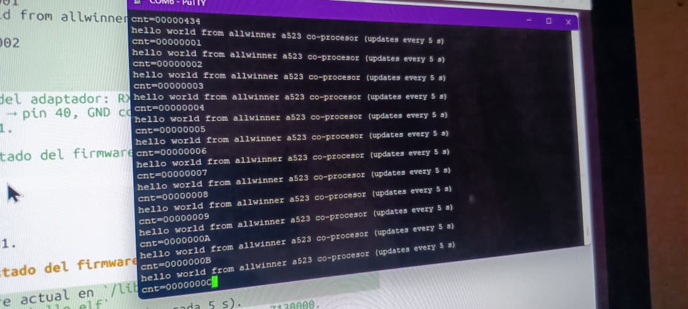
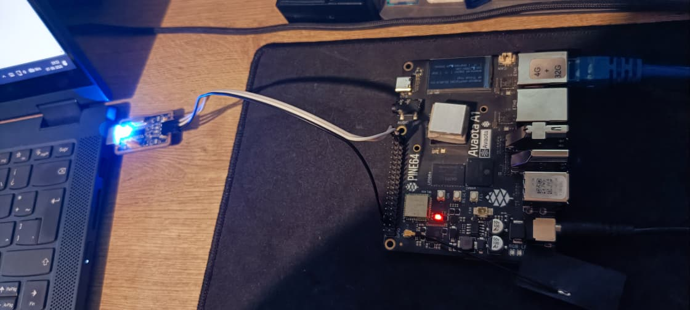
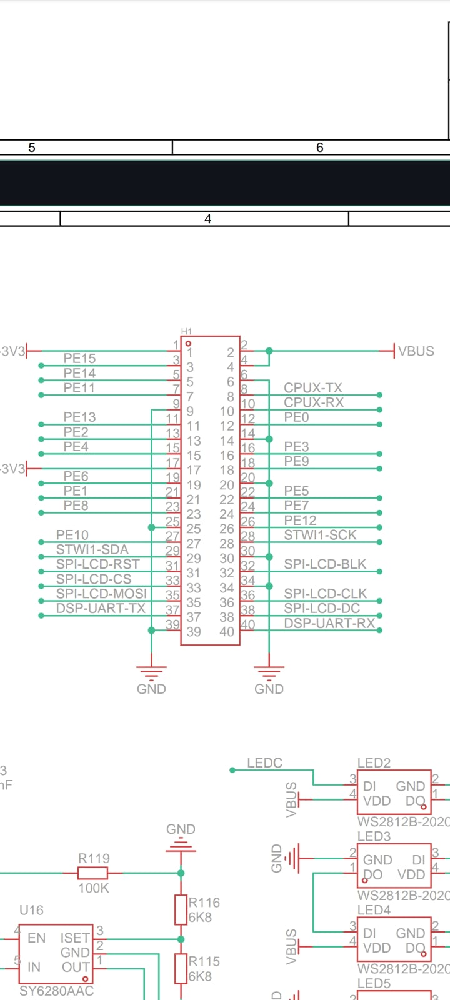
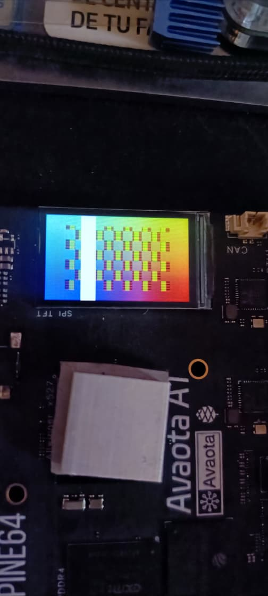
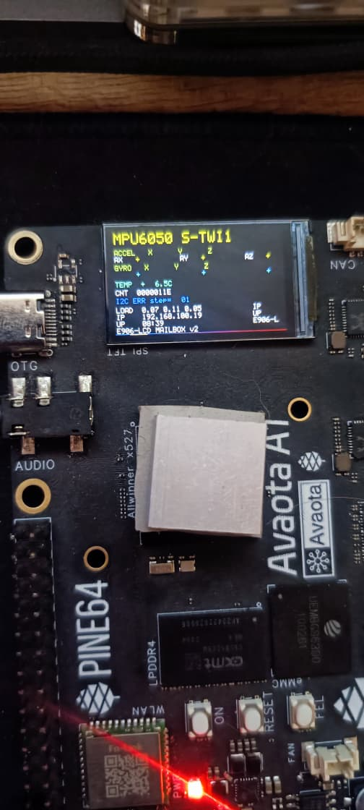
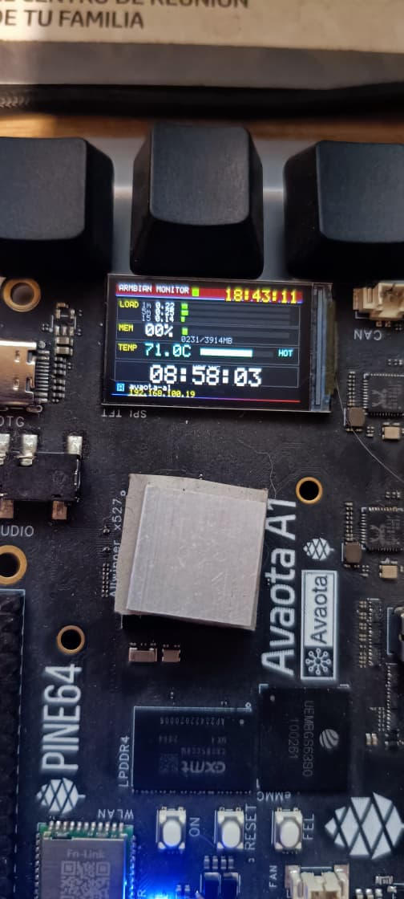

# E906 co-processor examples (Allwinner A523/T527 / Avaota-A1)

Bare-metal examples for the RISC-V E906 co-processor, cross-compiled for
`rv32imac`/`ilp32` with `riscv64-unknown-elf-gcc` and deployed as remoteproc
firmware for the `sun55i_e906_rproc` driver.

## Build

Each example has a `compile-*` script on `~/bin` (added to `PATH` in
`~/.bashrc`); you can also run them from this folder as `./compile-hello`, etc.

```
compile-hello           # hello/           -> e906-hello.elf
compile-lcd             # lcd/             -> e906-lcd.elf
compile-lcd-with-msg    # lcd-with-msg/    -> e906-lcd-msg.elf
compile-mpu6050-lcd     # mpu6050-lcd/     -> e906-mpu6050-lcd.elf
compile-sysmon          # sysmon/          -> e906-sysmon.elf
compile-klipper         # klipper/         -> e906-klipper.elf
```

## The important crt0.S fix

All examples share `crt0.S`, which enables the I-cache and D-cache
(`csrsi mhcr,1` / `csrsi mhcr,2`, i.e. `mhcr = 0x3`) before `main()`.

Without the D-cache enabled (the reset default), the A523 E906 returns **0 for
every data load** (SRAM0, DDR, even read-back of an own store) while stores and
instruction fetches still work.  The vendor firmware enables the caches, which
is why it works; keeping them disabled made our first firmware appear to
"receive nothing".

## Deploy (ARM side)

Copy the ELF to the board firmware path and bounce the remoteproc:

```sh
scp e906-hello.elf avaota@<ip>:/lib/firmware/rproc-7130000.e906_rproc-fw
ssh avaota@<ip> 'echo stop  | sudo tee /sys/class/remoteproc/remoteproc0/state'
ssh avaota@<ip> 'echo start | sudo tee /sys/class/remoteproc/remoteproc0/state'
```

The E906 boots from the ELF entry point (`0x3ffc0000`).  The DT reserves:
`riscvsram0` `0x3ffc0000 -> 0x07280000` (0x40000) and the DDR mailbox carveout
at `0x60000000`.

## Autostart at boot

Whatever ELF is stored at `/lib/firmware/rproc-7130000.e906_rproc-fw` is the
firmware loaded at boot: the `e906-rproc.service` unit (oneshot) waits for
`/sys/class/remoteproc/remoteproc0/state` to appear and then writes `start`,
which makes the kernel load that ELF into the E906.

The one-command way to make **sysmon** the boot firmware (on a freshly flashed
system or any running one):

```sh
git clone https://github.com/juanesf/e906-examples.git
cd e906-examples && sudo ./deploy-sysmon.sh
```

It installs `sysmon/e906-sysmon.elf` as the boot firmware (prebuilt in the
repo), the two systemd units and the `mbox_sysmon.py` daemon, then enables
them. The ELF is loaded by `e906-rproc.service` and the metrics are pushed by
`e906-sysmon.service` at every boot.

Only one firmware can be the boot firmware. To switch to another example
manually:

```sh
sudo cp /lib/firmware/rproc-7130000.e906_rproc-fw{,.prev}   # keep current
sudo cp e906-sysmon.elf /lib/firmware/rproc-7130000.e906_rproc-fw
echo stop  | sudo tee /sys/class/remoteproc/remoteproc0/state   # reload now
echo start | sudo tee /sys/class/remoteproc/remoteproc0/state
```

(or just reboot). Examples whose UI depends on the ARM host need a matching
systemd service that feeds the mailbox, e.g. `e906-sysmon.service` runs
`mbox_sysmon.py` for the sysmon dashboard; feed `lcd-with-msg` the same way
with `mbox_info.py`. Only enable one feeder at a time.

For the **klipper** example, `sudo ./deploy-klipper.sh` installs the
stepper/PWM firmware as boot firmware plus the host integration: the
`e906-mcu-bridge` daemon (`/usr/local/bin/e906_mcu_bridge.py`), the minimal
`printer.cfg` and the two systemd units — see the klipper section below. If
a standard Klipper host already exists (`klipper.service`, e.g. a kiauh
layout) only the bridge daemon is enabled and the existing host keeps
owning the PTY.

## Examples

### hello — "hello world" from the E906 co-processor

Writes a mailbox in the reserved DDR (`0x60000000`, DA == PA) and bumps a
counter forever.  Watch it from the ARM:

```sh
sudo devmem 0x60000000     # magic    = 0xE9061B0B
sudo devmem 0x6000000C     # counter  (keeps incrementing)
sudo devmem 0x60000040 16  # "HELLO WORLD FROM E906 CO-PROCESSOR!"
```

It also prints the message over S-UART0 @ 115200 8N1 (header pin 37 =
TX / SoC PM0).  Photos of the serial setup:





### lcd — gradient on the ST7789V

Drives the on-board 240x135 ST7789V LCD via S_SPI0 with no ARM help: animated
RGB gradient, moving white bar, frame counter.  Also keeps the mailbox
magic/counter for the ARM to read.



### lcd-with-msg — gradient + ARM message panel

Same as `lcd`, plus a text panel (top-left) that the **ARM pushes** over the
DDR mailbox every 2 s:

- `+0x40` `seq` (incremented per update)
- `+0x44` 4 x 32 ASCII text lines

Run `mbox_info.py` on the ARM to feed it:

```sh
sudo python3 mbox_info.py    # writes LOAD / IP / UP / version lines
```


The E906 polls `seq` every ~16 frames and redraws the panel.  Mailbox header
(E906 -> ARM): `+0x00` magic `0xE9061B0B`, `+0x04` version, `+0x08` flags,
`+0x0C` frame counter, `+0x10` result, `+0x14` error step.

### mpu6050-lcd — MPU6050 + LCD

> **Status: not working yet.** The GY-521 (MPU6050) sensor has not been
> verified on the board: the TWI/SMBus read has not been proven to work, so
> it is still unclear whether the sensor actually works or there is a bug
> (wiring, I2C pull-ups, address, or the TWI controller setup). Treat this
> example as a work in progress and use it as a base to debug the sensor.

Same LCD wiring as `lcd`, reading a GY-521 (MPU6050) IMU over TWI/SMBus and
rendering the measured orientation on the display.



### sysmon — system monitor dashboard (mailbox v3)

Live dashboard on the ST7789V fed by the ARM host via a v3 mailbox:
LOAD (1m/5m/15m with bars), MEM usage, CPU temperature (THS), uptime, clock
and a footer with hostname/IP.  The ARM side runs `mbox_sysmon.py` (a systemd
service `e906-sysmon.service`), which pushes metrics every second:

```sh
sudo python3 sysmon/mbox_sysmon.py   # daemon; reads /sys/class/thermal
```



Mailbox v3 layout (reserved DDR @ 0x60000000, all offsets 4-byte aligned):

| offset | field                 | writer |
|--------|-----------------------|--------|
| +0x00  | magic 0xE9061B0B      | E906   |
| +0x04  | version = 3           | E906   |
| +0x08  | flags 0x0000B00B      | E906   |
| +0x0C  | e906_cnt (frame)      | E906   |
| +0x10  | arm_cnt               | ARM    |
| +0x14  | status (bit0 valid)   | ARM    |
| +0x18..| load1/5/15 x1000      | ARM    |
| +0x24  | mem_total_KB          | ARM    |
| +0x28  | mem_used_KB           | ARM    |
| +0x2C  | temp_mC               | ARM    |
| +0x30  | uptime_s              | ARM    |
| +0x34  | clock_packed          | ARM    |
| +0x40  | seq + text[4][32]     | ARM    |

### klipper — stepper step/dir + heater/fan PWM (Klipper block 1)

> **Proof of concept.** The whole Klipper channel is a proof of concept: it
> is fully virtual (the E906 drives no real motor — every pin, endstop and
> PWM duty is simulated via the mailbox), it only implements a minimal
> subset of the Klipper MCU protocol, and it is not production code. You are
> free to use it as a base to create or improve your own implementation.

First Klipper building block on the E906: a step/dir stepper driver, a
software-PWM heater/fan and a homing/endstop block, commanded over
**S-UART0 @ 115200 8N1** (the same serial as `hello`, TX on header pin
37 / PM0).  ASCII commands, CR/LF terminated:

```
MOVE X 2000 1      # enqueue 2000 step pulses on PL2 (dir PL3, high)
MOVE Y 500 0       # enqueue 500 step pulses on PL4 (dir PL5, low)
SET H 128          # heater PWM duty 0-255 on PL6 (~1 kHz software PWM)
SET F 64           # fan PWM duty 0-255 on PL7
RATE 1500          # step rate in steps/s (50-20000, default 1000)
HOME X 0           # homing run on X toward min (0=min, 1=max)
ENDSTOP            # report X/Y endstop state (0/1)
FLUSH              # stop current move and drop the queue
STATUS             # X= Y= BUSY= H= F= RATE=
HELP               # command list
```

Moves are enqueued in an SRAM ring (QSIZE 16, so up to 15 queued) and
executed back-to-back with no gap: 4× `MOVE X 800 2500` runs at exactly
2500 steps/s for 3200 pulses (-0.1% measured).  `HOME` runs a long
timer-stepped move toward min/max, checking the endstop at every step
boundary; on trigger the move stops and the axis position is zeroed.

Pins (R-domain S_PIO): PL2=STEP_X, PL3=DIR_X, PL4=STEP_Y, PL5=DIR_Y,
PL6=HEATER, PL7=FAN.  PL0/PL1 are the PMIC `r_i2c0` and PL8+ the LCD, so
none of them are touched.

Endstops are read from the virtual input word (+0x60, ARM -> E906) OR-ed
with the physical PL14/PL15 hook (active-high, external pull-down).
`step_check.py --home` drives the virtual endstop mid-move and verifies the
E906 stops and zeroes the axis position.

Verify on the board that the E906 really toggles the physical pins — run
`step_check.py`, which sends commands through the **mailbox command slot**
(no serial cable needed) and counts the rising edges on the step pin,
comparing them against the E906's own mailbox position counters.  If the
mailbox does not accept a move (busy, full or timeout) the script falls
back to injecting the same ASCII command over S-UART0; `--mbox` disables
the fallback, `--uart` forces it:

```sh
sudo python3 klipper/step_check.py                       # MOVE X 2000 1, mailbox
sudo python3 klipper/step_check.py --mbox                # mailbox only, no fallback
sudo python3 klipper/step_check.py --queue 4 --steps 800 --rate 2500   # queue of 4
sudo python3 klipper/step_check.py --home                # homing + virtual endstop
sudo python3 klipper/step_check.py --pwm                 # PWM heater (PL6) / fan (PL7)
sudo python3 klipper/step_check.py --uart                # force injection via S-UART0
sudo python3 klipper/step_check.py --uart --queue 3 --steps 500 --rate 1500
sudo python3 klipper/step_check.py --observe             # you send the command
```

Mailbox v8 layout (reserved DDR @ 0x60000000).  Status words the E906
writes every loop:

| offset | field | writer |
|--------|-------|--------|
| +0x00  | magic 0xE9061B0B | E906 |
| +0x04  | version = 8       | E906 |
| +0x08  | flags 0x0000B00B  | E906 |
| +0x0C  | ms tick           | E906 |
| +0x10  | result            | E906 |
| +0x14  | error step        | E906 |
| +0x18  | pos_x (signed)    | E906 |
| +0x1C  | pos_y (signed)    | E906 |
| +0x20  | step rate (steps/s) | E906 |
| +0x24  | state (0 idle / 1 moving / 2 homing) | E906 |
| +0x28  | mxstatus CSR (diag) | E906 |
| +0x2C  | endstops (bit0 X / bit1 Y, 1=hit) | E906 |
| +0x34  | uart rxbuf length (diag) | E906 |
| +0x78  | uart RATE cmds executed (diag) | E906 |

Command slot (ARM -> E906, polled by the E906 every loop):

| offset | field | notes |
|--------|-------|-------|
| +0x40  | cmd | 0 none, 1 FLUSH, 2 SET, 3 RATE, 4 QADD, 5 QFREE, 6 ENDSTOP, 7 HOME, 8 MUTE |
| +0x44  | arg0 | QADD: axis / SET: ch / RATE: steps/s / HOME: axis / MUTE: 0\|1 |
| +0x48  | arg1 | QADD: steps / SET: duty / HOME: 0=min 1=max |
| +0x4C  | arg2 | QADD\|HOME: rate (0 = default) |
| +0x50  | ack | E906 increments once consumed |
| +0x54  | result | 0 ok, 1 busy/full, 2 bad args; QFREE: free slots; ENDSTOP: endstop bits |

+0x60 is the ARM->E906 virtual endstop input (bit0 X / bit1 Y, 1=hit),
read by the E906 for `ENDSTOP`/`HOME`.  The command slot is how the
Klipper MCU bridge talks to the E906 (see the host integration below):
write `arg0..arg2`, write `cmd`, and wait for `ack`/`result`.  QFREE
returns the free queue slots (15 = empty); QADD returns busy when full.

**Cache note (root cause found on the board):** the ARM writes the slot
through an uncached `/dev/mem` mapping, but the E906 runs with its D-cache
enabled (write-through), so the line covering +0x40..+0x54 can go stale and
the E906 never sees `cmd`.  `mbox_poll()` therefore starts with a
`dcache.ipa` (T-Head cache-maintenance instruction, invalidate line by
physical address) before reading the slot.  Verified on the board: `MOVE`
via mailbox returns `ok`, and the physical PL2/PL4 edge count matches the
 E906's own step counter (`[OK] 799 pin pulses ... (100%)`).

`dcache.ipa` is also applied before the ARM->E906 reads in `sysmon` and
`lcd-with-msg`.  **Do not use `dcache.iall` (invalidate all) on this core:**
it drops dirty SRAM0 lines and crashes the E906, which in turn stalls ARM
reads of the DDR mailbox (observed as multi-minute hangs).  Only invalidate
specific DDR lines (safe, write-through).

**Serial channel caveat:** the ARM and the E906 share the same S-UART0
module, so `step_check.py --uart` injects commands into the shared TX
register, which only reaches the E906's RX if the board's TX (PM0 / pin
37) is physically wired to RX (PM1 / pin 40).  That same jumper also loops
the E906's own replies back into its RX (self-feedback flood), so the
script MUTEs the E906 (mailbox cmd 8), waits for the stale backlog to
drain and pushes `\r` until the E906 reports an empty rxbuf (+0x34) — a
truncated in-flight reply can otherwise wedge rxbuf with a half-parsed
line forever.  Commands are paced at ~1 ms/char with 20 ms between lines:
the RX FIFO is depth 1 and back-to-back chars overrun while the E906 is
busy stepping.  With that pacing the full UART queue test passes reliably
(`[OK] 1498 pin pulses vs 1500 steps (100%), timing -0.2%`).

### klipper — Klipper host integration (MCU bridge)

`klipper/e906_mcu_bridge.py` makes the E906 look like a regular Klipper
`mcu` over a PTY (runs as root, needs `/dev/mem`):

  * Klipper connects to the PTY symlink `/tmp/klipper_host_e906`
    (`[mcu] serial: /tmp/klipper_host_e906` in `klipper/printer.cfg`).
  * The bridge speaks the standard Klipper wire protocol (VLQ frames +
    CRC16-CCITT, identify handshake with a compressed dictionary) and
    translates each command to the mailbox v8 command slot above:
    `config_stepper`/`queue_step` -> QADD, `endstop_home`/`trsync_*` ->
    ENDSTOP + FLUSH on trigger, `update_digital_out` -> SET (heater PL6 /
    fan PL7).  A virtual 50 MHz clock backs Klipper clocksync.
  * The identify dictionary advertises `version v0.13.0-e906`,
    `CLOCK_FREQ = 50000000`, `RECEIVE_WINDOW = 192` and the `pin`
    enumeration `PL2=2 PL3=3 PL4=4 PL5=5 PL6=6 PL7=7 ES_X=16 ES_Y=17`.
    `config_*` pins are sent as `%c`/`%u` (the `Enumeration` value), not
    as `%s` strings.

Start it, or let the boot daemon do it:

```sh
sudo python3 klipper/e906_mcu_bridge.py        # debug / foreground
sudo systemctl enable --now e906-mcu-bridge    # boot daemon (unit)
```

Systemd units shipped in `klipper/` (installed by `deploy-klipper.sh`):

  * `e906-mcu-bridge.service` — the bridge daemon (root).
  * `klipper-printer.service` — `klippy.py` against `klipper/printer.cfg`.

Self-check without a printer host — the unit tests mock `/dev/mem` and run
without root:

```sh
python3 klipper/test_bridge.py                  # protocol translator
python3 klipper/test_host.py                    # identify over the PTY
klipper/test_serialqueue_pty.py                 # real Klipper serialqueue
```

With the bridge up, Klipper's log shows `Loaded MCU 'mcu' 35 commands
(v0.13.0-e906 / e906-bridge)` and `Configured MCU 'mcu' (500 moves)`;
Mainsail/Moonraker reports "Printer is ready" and the heartbeat keeps
`send_seq`/`receive_seq` advancing with `bytes_invalid=0`.

All pins/endstops are virtual (no physical wiring), so mark the axes homed
before moving.  `SET_KINEMATIC_POSITION` needs `[force_move]` +
`enable_force_move: True` in the config (already in `klipper/printer.cfg`):

```sh
curl -X POST http://localhost:7125/printer/gcode/script \
     -H "Content-Type: application/json" \
     -d '{"script":"SET_KINEMATIC_POSITION X=0 Y=0 SET_HOMED=xy"}'
curl -X POST http://localhost:7125/printer/gcode/script \
     -H "Content-Type: application/json" -d '{"script":"G1 X5 Y8 F600"}'
# toolhead position -> [5, 8, 0, 0], print_time advances
```

To test homing, drive the virtual endstop (bit0 = X, bit1 = Y at `+0x60`,
1 = hit) while `G28` runs — the E906 ORs the virtual input with the
physical hook, and the trsync poll fires on it:

```sh
# terminal 1: start homing, then write a hit from another shell:
curl -X POST http://localhost:7125/printer/gcode/script \
     -H "Content-Type: application/json" -d '{"script":"G28 X"}'
# terminal 2 (quick, while it moves):
sudo devmem 0x60000060 32 1
# homing completes: homed_axes = x, position [0, ...]
```

Without the virtual hit, `G28` runs the full travel and fails with
`No trigger on stepper_x after full movement` — expected, since there is no
physical endstop.

### klipper — printing from the E906 to the Klipper console (not implemented)

A recipe, not implemented yet, for showing a line that *originates on the
E906* in the Mainsail console.  Klipper has no native "MCU -> console"
message, so the text has to travel: **E906 -> mailbox -> bridge ->
Moonraker -> M118 -> console**.

  1. **Firmware (`main.c`):** post text into free mailbox words
     (e.g. `+0x64..+0x77`, 20 bytes) plus a `seq` at `+0x58`; bump `seq`
     once per new message.  Avoid `+0x78` (already used as a UART diag
     counter).  The E906 never invalidates its own writes (write-through
     cache), so the ARM sees them with an uncached `/dev/mem` mapping.
  2. **Bridge (`e906_mcu_bridge.py`):** in the worker loop, compare the
     mailbox `seq` with the last seen one; on change, read the text and
     POST it to Moonraker:

     ```sh
     curl -X POST http://localhost:7125/printer/gcode/script \
          -H "Content-Type: application/json" \
          -d '{"script":"M118 <texto>"}'
     ```

     Catch/timeout the HTTP call so a down Moonraker never wedges the
     bridge (it is the safety-critical path for the E906 queue).
  3. **Config (`printer.cfg`):** add `[respond]` — it registers the `M118`
     handler (`klippy/extras/respond.py`); without it the message shows up
     as `Unknown command:"M118"`.  `[respond]` defaults to an echo prefix
     of `// `, which is exactly what Mainsail renders in the console.

The message appears in the console as `// <texto>`, timestamped on arrival;
a periodic heartbeat carrying the E906's `ms tick` (`+0x0C`) makes a nice
live demo.  Timing notes: do not spam M118 faster than the host drains the
gcode queue, and remember the whole setup is a proof of concept.

## Layout notes

- Link base: DA `0x3ffc0000` (SRAM0), stack at the top of SRAM0
  (`0x40000000`).
- The E906's `crt0.S` also zeroes `.bss` and sets `sp` before `main`.
- `/dev/mem` on the board only allows **aligned 32-bit accesses**; wider or
  unaligned reads/writes SIGBUS (mailbox readers must use word-at-a-time
  `struct.unpack_from`).
- **Intermittent SIGBUS on the DDR mailbox while an LCD firmware runs:**
  reading `0x60000000` from the ARM can sporadically abort (SIGBUS) or hang
  while the E906 is driving the ST7789V (heavy S_SPI0 traffic) — reproduced
  with the *unmodified* `lcd-with-msg` too, so it is a bus/board quirk, not
  the cache fix.  A retry after a moment succeeds.  The Klipper firmware
  (no LCD) does not trigger it.

## Acknowledgements

Investigation and on-board testing for these examples (the E906 cache root
cause, the mailbox protocol, the ST7789V wiring, the sysmon daemon and the
Klipper MCU bridge integration) were carried out with the assistance of
opencode.

## License

MIT — see [LICENSE](LICENSE).
